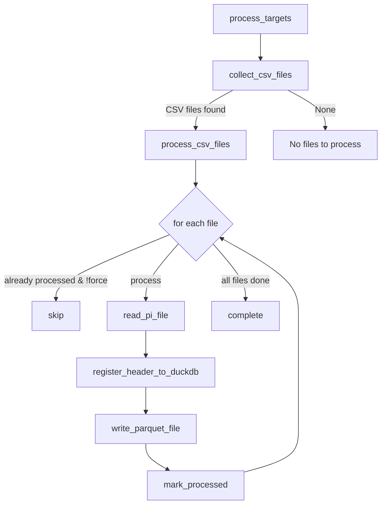

# csv_to_db

このプロジェクトは PI システムから出力された CSV ファイルを解析し、Parquet 形式のデータセットと DuckDB データベースへ変換・登録するためのユーティリティ群を提供します。

## 特徴

- `search_csv_file` 関数は `.zip` アーカイブも検索し、含まれる CSV ファイルを `__extracted_csvs__` ディレクトリに展開して処理します。
- `.zip` から展開する際、`..` を含むパスや絶対パスは不正な書き込みを避けるために警告を出して無視します。
- 処理済みファイルの履歴は DuckDB に保存されます。ファイル名と保存日時に加え、`plant_name`、`machine_no`、`data_source` の組み合わせで管理され、`process_csv_files` は既に処理済みのファイルをスキップするか、`force=True` の場合は再処理できます。
- `param_master` テーブルも `plant_name`、`machine_no`、`data_source` を含めて管理され、各設備ごとのパラメータ情報を記録します。
- `parameter_id_master` テーブルでは `param_id` ごとの標準名称（英語・日本語）を保持し、CSV 取込時に未登録 ID を追加します。
- `process_targets` は複数のディレクトリやファイル（`.zip` を含む）から CSV を収集し、データソースごとの読込処理を実行し、変換、履歴更新、マスターテーブル更新を一度に実行します。

## 処理フロー

